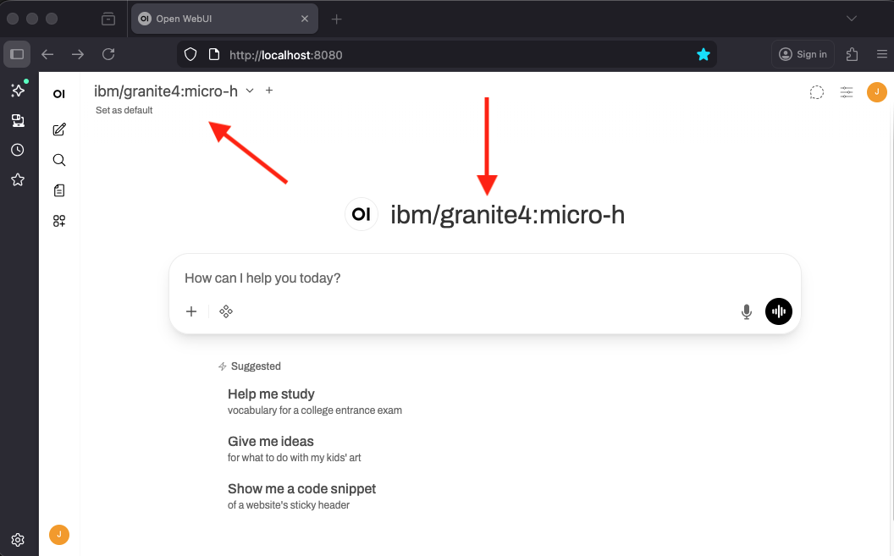
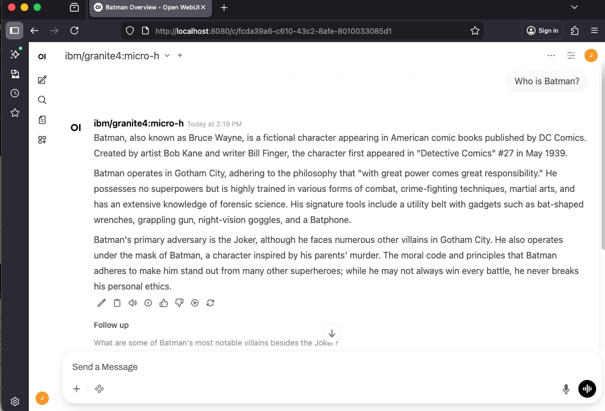

## Prework

This lab assumes you have completed the [prework](../pre-work/README.md). In particular:

* Installed [uv](../pre-work/README.md#install-uv)
* Installed [Open-WebUI](../pre-work/README.md#install-open-webui)
* Installed [Ollama](../pre-work/README.md#install-ollama)
* Pulled [models](../pre-work/README.md#pull-models-with-ollama)

## Setup

Let's start by configuring [Open-WebUI](../pre-work/README.md#install-open-webui) and `ollama` to talk to one another. The following screenshots will be from a Mac, but this should be similar on Windows and Linux.

Start the Open WebUI server (if not already running):

### macOS/Linux

```shell
DATA_DIR=~/.open-webui uvx --python 3.11 open-webui@latest serve
```

### Windows

```shell
$env:DATA_DIR="C:\open-webui\data"; uvx --python 3.11 open-webui@latest serve
```

Open up Open-WebUI by using this URL with your browser: [http://localhost:8080/](http://localhost:8080/)


If you see something similar, Open-WebUI is installed correctly! Continue on, if not, please find a workshop TA or raise your hand for some help.

Click *Getting Started*. Fill out the next screen and click the *Create Admin Account*. This will be your login for your local machine. Remember that this because it will be your Open-WebUI configuration login information if want to dig deeper into it after this workshop.

You should see the Open-WebUI main page now, with `ibm/granite4:micro-h` right there in the center!



## Testing the Connection

Test it out! I like asking the question, "Who is Batman?" as a sanity check. Every LLM should know who Batman is.

The first response may take a minute to process. This is because `ollama` is spinning up to serve the model. Subsequent responses should be much faster.



You may notice that your answer is slightly different then the screen shot above. This is expected and nothing to worry about!

## Conclusion

**Congratulations!**
